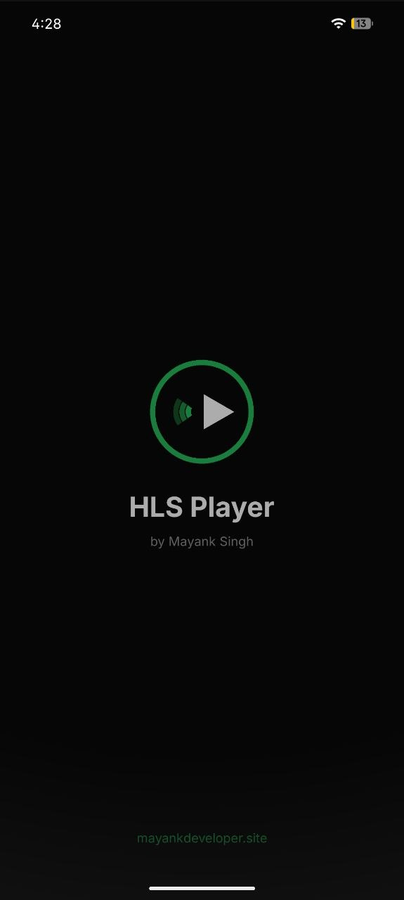
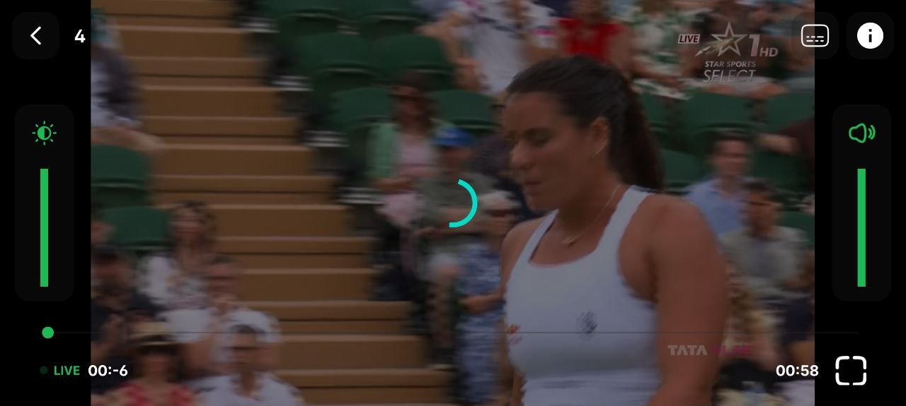
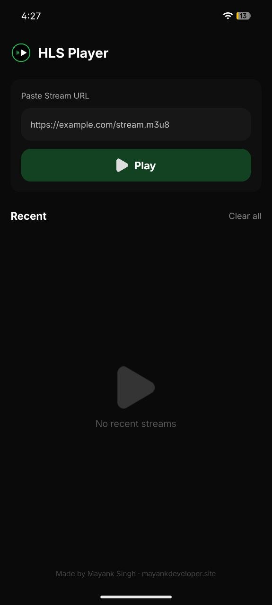

# 📺 Android HLS Player

<p align="center">
   &nbsp;
   &nbsp;
   &nbsp;
  
</p>

<p align="center">
  <a href="assets/hlsplayer-debug.apk"></a>
  
  
  
</p>

---

A lightweight, feature-rich HLS/M3U8 stream player for Android built with **ExoPlayer (Media3)**. Supports live streams, quality selection, gesture controls, and more.

---

## ✨ Features

| Feature | Description |
|---|---|
| 🎬 Multi-format | HLS (M3U8), MP4, and direct stream URLs |
| 📶 Quality Selector | Auto, 1080p, 720p, 480p, and more |
| 🔴 Live Detection | Auto-detects live streams with blinking LIVE indicator |
| 🌟 Gesture Controls | Swipe left/right for brightness & volume |
| 🕐 Watch History | Saves recent URLs and watch progress |
| 📱 Picture-in-Picture | PiP mode support |
| ⏩ Seek Controls | 10s forward/backward with visual feedback |

---

## 📲 Download

> **[⬇️ Download Latest APK](assets/hlsplayer-debug.apk)**

Or clone and build from source (see below).

---

## 🛠️ Build from Source

**Requirements**
- Android Studio Hedgehog or newer
- Android SDK 24+

**Steps**
```bash
git clone https://github.com/mynkdev-21/android-hls-player.git
```
1. Open in Android Studio
2. Let Gradle sync
3. Run on device or emulator

---

## 🧰 Built With

- [Media3 ExoPlayer](https://developer.android.com/media/media3/exoplayer) — Video playback engine
- **Kotlin + Java** — App logic
- **Material Components** — UI

---

## 📄 License

```
MIT License — free to use, modify and distribute.
```

---

<p align="center">
Built with ❤️ by [Mayank Singh](https://github.com/mynkdev-21) · [LinkedIn](https://linkedin.com/in/mynk-dev) · [Portfolio](https://mayankdeveloper.site)
</p>
